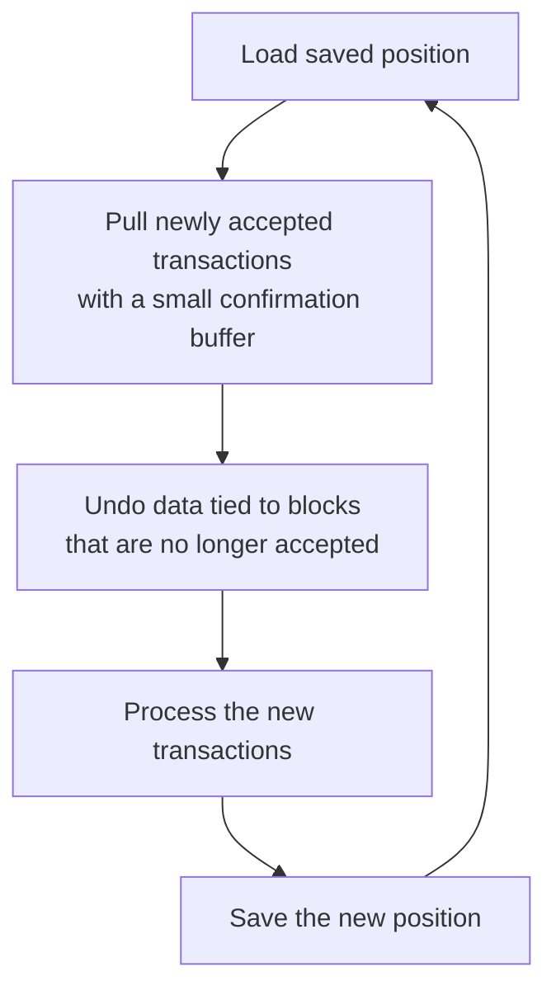

This page covers the main ways to follow accepted transactions and common patterns.

> [!NOTE]
> Full runnable examples for this guide live in [`/examples`](https://github.com/kaspanet/docs/tree/main/examples).

## Typical pull-based system overview



## Accepted Transactions With Data

Use `getVirtualChainFromBlockV2` when you need transaction fields (payload, sender address, etc.).

```ts
const checkpoint = undefined;

// `pruningPointHash` is the oldest checkpoint the node still keeps available.
const { pruningPointHash } = await rpc.getBlockDagInfo();
const startHash = checkpoint ?? pruningPointHash;

const response = await rpc.getVirtualChainFromBlockV2({
  startHash,
  minConfirmationCount: 30,
  dataVerbosityLevel: "High",
});

// The response is ordered forward from `startHash` toward newer blocks.
for (const block of response.chainBlockAcceptedTransactions) {
  for (const tx of block.acceptedTransactions) {
    console.log(
      block.chainBlockHeader.hash,
      tx.verboseData?.transactionId,
      tx.payload,
    );
  }
}

const nextCheckpoint =
  response.addedChainBlockHashes[response.addedChainBlockHashes.length - 1] ??
  startHash;

console.log("Next checkpoint:", nextCheckpoint);
```

For a first run, leave `checkpoint` empty and fall back to `pruningPointHash`. The call moves forward from `startHash` toward the node's current block tip. In a realistic system, persist `nextCheckpoint` after each successful pass and feed it back in as `checkpoint` on the next run.

## Listen for Accepted Transaction IDs

Use `getVirtualChainFromBlock` when you only need accepted transaction IDs, without full transaction data.

```ts
const checkpoint = undefined;

const { pruningPointHash } = await rpc.getBlockDagInfo();
const startHash = checkpoint ?? pruningPointHash;

const response = await rpc.getVirtualChainFromBlock({
  startHash,
  includeAcceptedTransactionIds: true,
  minConfirmationCount: 30,
});

for (const batch of response.acceptedTransactionIds) {
  console.log(batch.acceptingBlockHash, batch.acceptedTransactionIds);
}

const nextCheckpoint =
  response.addedChainBlockHashes[response.addedChainBlockHashes.length - 1] ??
  startHash;

console.log("Next checkpoint:", nextCheckpoint);
```

This follows the same checkpoint pattern as `getVirtualChainFromBlockV2`, but returns accepted transaction IDs instead of transaction objects.

### Advanced: Live Subscription

If you want the same ID-only view as a live stream, `SubscribeVirtualChainChanged` is the subscription-based alternative.

```ts
rpc.addEventListener("virtual-chain-changed", (event) => {
  for (const batch of event.data.acceptedTransactionIds) {
    console.log(batch.acceptingBlockHash, batch.acceptedTransactionIds);
  }
});

await rpc.subscribeVirtualChainChanged(true);
```

Passing `true` asks the node to include `acceptedTransactionIds` with each virtual-chain change.

If the stream disconnects or your consumer falls behind, recover from the last durable checkpoint with `getVirtualChainFromBlock` and `includeAcceptedTransactionIds: true`, then continue with `SubscribeVirtualChainChanged`. When you don't need very-high reactivity, you should aim for a pull-based flow at first to avoid complexity of reconciliation loops.

## Reorgs Near the Tips

Near the active DAG tips, virtual-chain movement is still settling, so ingestion systems should usually stay a few confirmations behind. `minConfirmationCount` is a built-in buffer for the pull flow, and the same idea applies to any downstream processing that wants durable accepted transactions.

Also treat `removedChainBlockHashes` as rollback input. Keep enough local state to know which processed transactions were attached to which accepting block. If a later response or notification removes one of those blocks from the virtual chain, invalidate the transactions you derived from it and then apply the accepted transactions that arrive for the replacement path described by `addedChainBlockHashes`.

## Performence consideration

Because Kaspa’s architecture enables high throughput, you should design your pipelines to ingest events quickly. There is no single rule of thumb, but here are a few common patterns:

- Filter out unnecessary or unwanted transactions as early as possible.
- Introduce a queue between your listener and your worker(s).
- Parallelize workers for pipelines that are independent of processing order.
