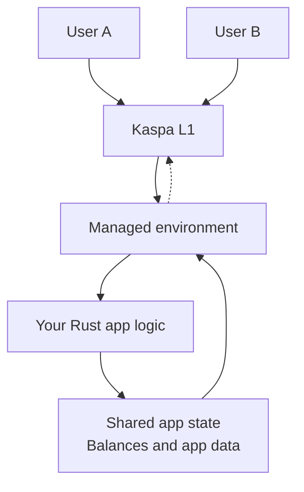

## What it is

Start here when one app needs shared-state concurrency by default.

You build one app in Rust. It runs inside a managed environment that provides built-in accounts, balances, shared-state execution.
If your product is mostly about native asset rules without default shared-state concurrency, first check whether `Covenants` fits more naturally.

## Mental model

## Pick this when

- Many users need to touch the same app state without waiting for previous actions to finish.
- You want built-in accounts and shared-state execution.

## Good fits

- Consumer apps with many concurrent active users
- Trading venues or product suites

## When not to use it

- Your product is mostly about native asset rules and flows.
- You do not need concurrency by default and your state fits naturally in `Covenants`.
- Each action should be verified and settled independently.
- You need a custom account model or a privacy-first execution model.

## Current expectations

This option is in construction.

If you are thinking about broader app-to-app composition, treat [Full vProgs](/programmability/full-vprogs) as the future direction rather than a separate current option.
