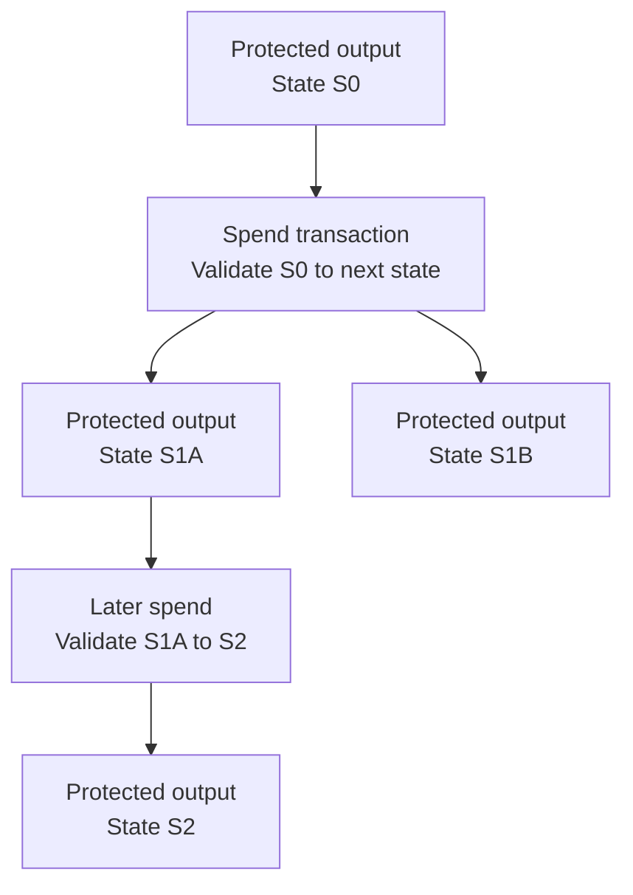

## What it is

Start here when the product is best expressed as asset-native state on Kaspa L1.

They build on [covenant-style spending constraints](https://github.com/someone235/kips/blob/6fc7a1b20bfe22a316dec76ebd20fe7d9e18722c/kip-0017.md), but the model here is broader than a plain covenant. A protected output can carry state, define a state transition, validate the next outputs, and keep non-forgeable lineage through [Covenant IDs](https://github.com/michaelsutton/kips/blob/0581f55487ed7c471fbd3615684ebba7bae47e63/kip-0020.md). If the main job of the product is transfer policy, issuance, custody, release conditions, or asset-native state machines, this is the closest fit.
One protected state advances sequentially, though independent states or sub-apps can still run in parallel.

## Mental model

Picture a chain of protected outputs, where each spend must create the next valid state.

## Pick this when

- One shared state can advance one valid step at a time.
- Your product is centered on asset behavior and stateful outputs such as transfers, custody, issuance, unlock conditions, controlled flows, or output-level state transitions.
- Your state stays small relative to covenant redeem-script size. The script size limit is about 300 KB, and your usable state must stay below that because the contract code also consumes part of the same script budget.

## Good fits

- Vaults and treasury controls
- Escrow-like flows
- Time-based or condition-based unlocking
- Native asset logic
- Issuance and transfer policies

## When not to use it

- Many users need to mutate the same shared state concurrently.
- Your state becomes too large or your state transitions become too complex for `Covenants` to stay pleasant.
- Each action needs custom private or proof-driven verification.

## Current expectations

You can build with this model today, but the tooling is still early.

[Silverscript](https://github.com/kaspanet/silverscript) is the main builder reference point right now. It gives you a higher-level way to define your covenant and state transitions.

Expect some manual work around deployment, transaction construction, and state handling.
