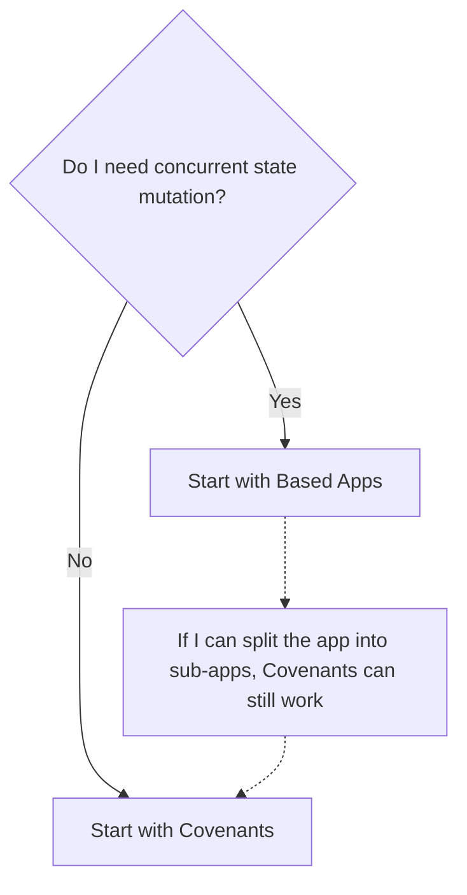

Kaspa programmability is not one model. It is a set of building blocks.

> [!IMPORTANT]
> Tooling and builder workflows are still evolving. Use this guide to choose the right option, then go deeper as the implementation stack matures.

If you come from EVM or Solana, do not look for one universal smart contract box that fits everything.

On Kaspa, the first question is: Do I need concurrent state mutation?
If yes, it means **I want** multiple users being able to modify one app state at the same time

If my app can be split into sub-apps, `Covenants` can still work when concurrent state mutation exists across those separate sub-apps.

## Current options

### Covenants

Best when the product is centered on asset rules and stateful outputs: who can move funds, how outputs evolve, how issuance works, or which conditions must hold before assets flow. Directly expressed on Kaspa L1.

[Learn more about Covenants](/programmability/covenants)

### Based Apps

Best when you want one app with built-in accounts and shared state. You write the app in Rust.

[Learn more about Based Apps](/programmability/based-apps)

## Future direction

[Full vProgs](/programmability/full-vprogs) are the future direction for app-to-app composition across independent apps. If you picked `Based Apps`, treat Full vProgs as end-goal.

## Specialized option

### Inline ZK

> [!WARNING]
> Consider `Based Apps` and `Covenants` first. This option exists, but it usually demands significantly more builder effort.

Best when each action needs its own proof or validity check and should be verified and settled independently.

[Learn more about Inline ZK](/programmability/inline-zk)
