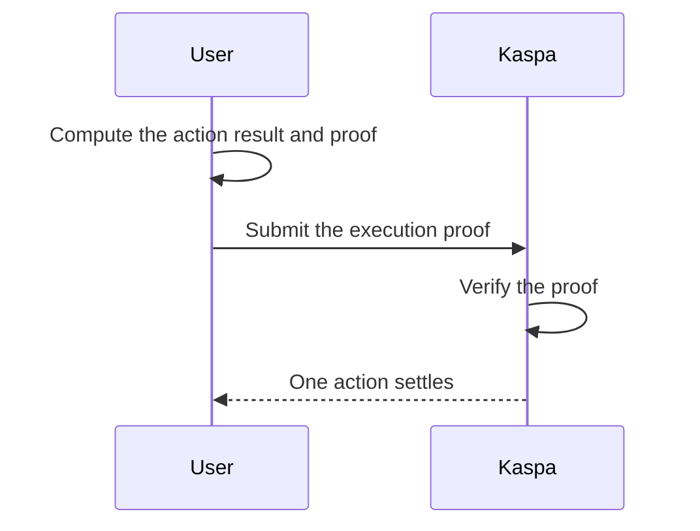

## What it is

Start here when each action should prove its own validity and settle independently.

This is the specialist path for products whose core job is the proof attached to each action: privacy, custom validity rules, or a custom account model.

> [!WARNING]
> Consider [Based Apps](/programmability/based-apps) and [Covenants](/programmability/covenants) first. If your main need is shared app concurrency, start with Based Apps; if it is native asset rules and flows, start with Covenants.

## Mental model

## Pick this when

- Each action needs its own proof or custom validity check before it settles.
- Each action should be verified and settled independently instead of living inside one shared-state app.
- Privacy is part of the product.
- You need a custom account model instead of the built-in one from `Based Apps`.
- You want Kaspa to verify the result without putting all of the computation on-chain.

## Good fits

- Privacy-preserving actions
- Proof-verified workflows
- Independent actions with custom settlement rules

## When not to use it

- Your logic is mostly about asset rules and flows.
- You want built-in accounts and ongoing shared state.

## Current expectations

This is the most specialized and demanding option in this guide.

You own more of the proof design, prover architecture, and operational setup than in `Covenants` or `Based Apps`.
